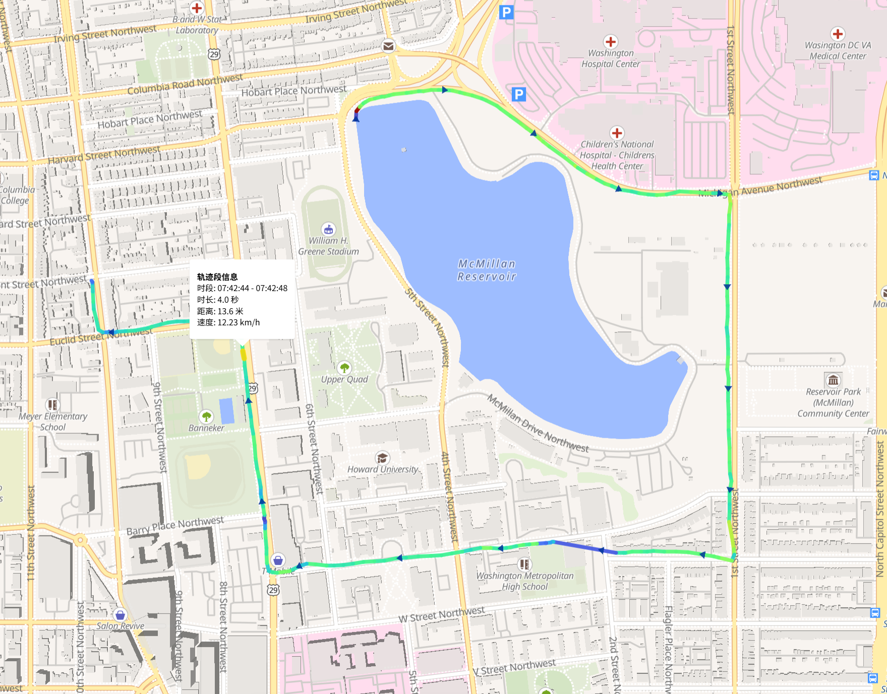

# GPX 轨迹可视化工具

一个基于 WebComponent 的纯前端 GPX 轨迹可视化工具，支持多种交互方式导入 GPX 文件，具备丰富的轨迹分析与可视化能力，适合运动、旅行轨迹的回放与分析。

> **⚠️ 警告**: 本项目（包括代码、文档和本README）完全由AI大语言模型生成。未经充分测试和验证，使用后果自负。

## 项目特色

- **原生 WebComponent**：自定义元素 `<gpx-viewer>`，支持多实例和 Shadow DOM 样式隔离，易于集成到任意网页。
- **纯前端、零依赖后端**：所有功能均在浏览器端实现，无需服务器，数据隐私有保障。
- **多种轨迹导入方式**：
  - 拖放 GPX 文件到地图区域
  - 点击提示框选择本地文件
  - 通过 JS 调用 `setGpx(gpxString)` 动态加载
- **丰富的轨迹可视化**：
  - 完整轨迹（蓝色线条）
  - 已走轨迹（绿色线条，随进度变化）
  - 当前位置标记（红色圆点）
  - 轨迹方向箭头（自动缩放、动态生成）
  - 静止区段检测与高亮（自动识别停留点，显示暂停图标与弹窗信息）
  - 轨迹分段着色（支持速度/时间/固定色多种模式）
- **交互与信息展示**：
  - 进度滑块：可回放轨迹任意时刻
  - 实时显示当前时间点与海拔
  - 鼠标悬停轨迹/静止点显示详细信息弹窗
  - 地图自动缩放适应轨迹范围
- **高性能与美观设计**：
  - 基于 MapLibre GL JS 地图引擎
  - 响应式布局，适配桌面与移动端
  - 现代化 UI，控件与地图样式隔离

## 技术栈

- **MapLibre GL JS**：开源地图渲染引擎
- **原生 JavaScript**：无第三方框架
- **WebComponent/Shadow DOM**：实现样式与功能隔离
- **HTML5 APIs**：FileReader、Drag and Drop、Custom Elements

## 使用方法

1. **打开应用**  
   直接用浏览器打开 `index.html`，无需任何构建或依赖安装。

2. **导入 GPX 文件**  
   - 拖放 GPX 文件到地图区域  
   - 或点击中央提示框选择文件  
   - 或通过 JS 动态调用 `<gpx-viewer>.setGpx(gpxString)`

3. **查看与分析轨迹**  
   - 地图自动显示完整轨迹
   - 使用底部滑块回放轨迹进度
   - 查看静止点、速度变化、时间分布等信息

## 支持的 GPX 格式

- 标准 GPX 1.0/1.1，需包含 `<trkpt lat="" lon="">`，建议含 `<time>`（用于进度回放）和 `<ele>`（海拔）

## 进阶用法

- **多实例支持**：可在同一页面插入多个 `<gpx-viewer>`，互不干扰
- **JS API**：
  - `setGpx(gpxString)`：加载 GPX 字符串
  - `reset()`：重置组件状态
- **事件支持**：可监听自定义事件（如轨迹加载完成、进度变化等，详见源码）

## 地图数据

默认使用 [OpenFreeMap](https://openfreemap.org/) 免费地图样式，支持自定义地图源。

---

如需更详细的 API 或二次开发说明，请参考源码注释。
