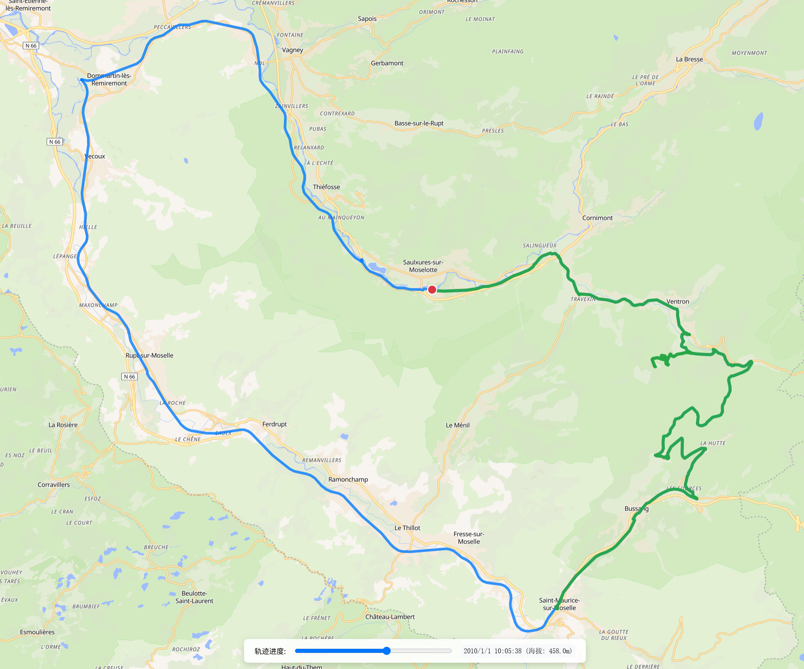

# GPX 轨迹可视化工具

一个基于网页的 GPX 轨迹可视化工具，支持导入 GPX 文件并在地图上展示轨迹，具有进度控制功能，帮助用户回顾和分析运动或旅行路径。

> **⚠️ 警告**: 本项目（包括代码、文档和本README）完全由AI大语言模型生成。未经充分测试和验证，使用后果自负。

## 功能特点

- **轻量级**: 纯前端实现，无需服务器支持
- **GPX 轨迹解析**: 解析标准 GPX 格式文件中的轨迹点数据
- **双重导入方式**: 
  - 拖放 GPX 文件到地图区域
  - 点击提示框打开文件选择对话框
- **可视化效果**:
  - 完整轨迹显示（蓝色线条）
  - 当前进度轨迹显示（绿色线条）
  - 当前位置标记（红色圆点）
  - 自动调整地图视角以显示整个轨迹
- **进度控制**: 通过滑动条控制查看轨迹上的不同时间点
- **实时信息显示**: 显示当前时间点和海拔高度信息

## 技术栈

- **MapLibre GL JS**: 开源地图渲染引擎，用于显示地图和轨迹
- **原生 JavaScript**: 处理 GPX 解析和用户交互
- **HTML5 APIs**: 
  - FileReader API 用于读取 GPX 文件
  - Drag and Drop API 用于拖放功能
  - Web Storage API 用于潜在的数据保存（未来功能）

## 使用方法

1. **打开应用**:
   - 在浏览器中打开 `index.html` 文件，或访问部署的网页版本

2. **导入 GPX 文件**:
   - **方法一**: 将 GPX 文件拖放到地图区域
   - **方法二**: 点击中央提示框打开文件选择对话框

3. **查看轨迹**:
   - 导入成功后，地图会自动调整显示整个轨迹
   - 蓝色线条表示完整轨迹
   - 初始位置显示为红色圆点

4. **控制回放**:
   - 使用底部进度条滑动查看不同时间点的位置
   - 绿色线条表示已经走过的轨迹部分
   - 底部信息栏显示当前时间点和海拔高度

## 支持的 GPX 格式

该工具支持标准 GPX 1.0 和 1.1 格式文件，需要包含以下关键元素：

- `<trkpt>` 元素，具有 `lat` 和 `lon` 属性
- 每个轨迹点应有 `<time>` 子元素（用于时间轴功能）
- 可选 `<ele>` 子元素（海拔高度）

## 地图数据

本项目使用 [OpenFreeMap](https://openfreemap.org/) 提供的地图样式数据，这是一个基于开放数据的免费地图服务。
