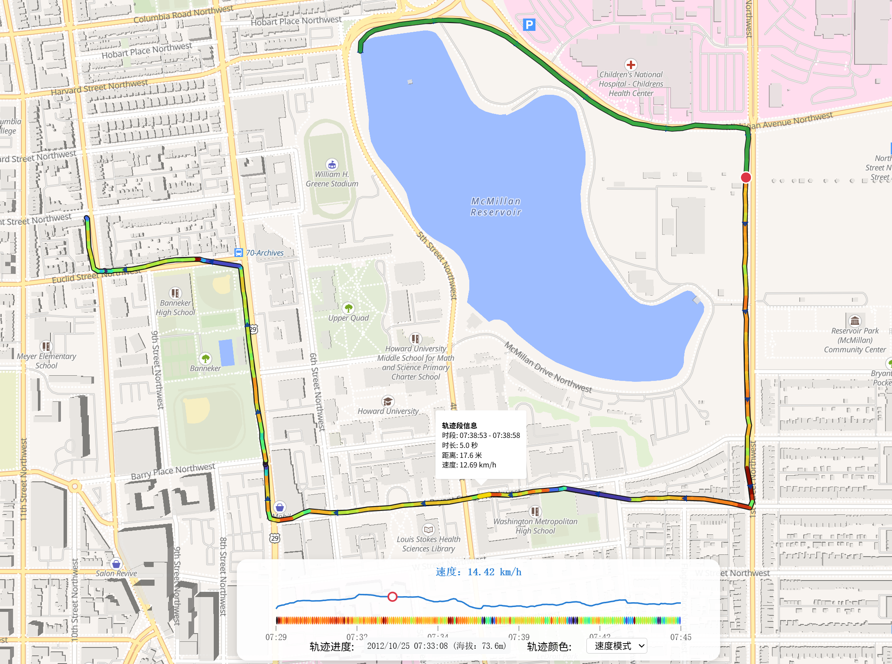

# GPX 轨迹可视化工具

一个功能强大的基于 WebComponent 的纯前端 GPX 轨迹可视化工具，支持多种交互方式导入 GPX 文件，具备智能轨迹分析、动态进度条、静止检测等高级功能，适合运动、旅行轨迹的深度分析与回放。

> **⚠️ 警告**: 本项目（包括代码、文档和本README）完全由AI大语言模型生成。未经充分测试和验证，使用后果自负。



## 主要特色

### 📦 原生 WebComponent 架构
- **自定义元素** `<gpx-viewer>`：支持多实例部署，完全的 Shadow DOM 样式隔离
- **零依赖**：纯前端实现，无需后端服务器，数据隐私完全保障
- **易集成**：可嵌入任意网页，支持属性绑定和 JavaScript API

### 📁 多样化文件导入
- **拖拽上传**：直接将 GPX 文件拖放到地图区域
- **文件选择**：点击提示区域选择本地文件
- **程序化加载**：通过 `setGpx(gpxString)` API 动态加载轨迹数据
- **错误处理**：完善的文件验证和错误提示机制

### 🎨 智能轨迹可视化
- **多层次轨迹渲染**：
  - 完整轨迹线（带描边的蓝色线条）
  - 已走轨迹（动态绿色线条）
  - 高亮悬停段（金黄色临时高亮）
  - 当前位置标记（红色圆点 + 白色边框）
- **方向指示箭头**：
  - 动态密度调整（根据缩放级别自动优化箭头间距）
  - 精确方向计算（基于轨迹段实际方位角）
  - 性能优化（避免过度渲染）
- **颜色编码模式**：
  - **固定色模式**：统一蓝色显示
  - **速度模式**：基于 Turbo 色谱显示速度变化（P1-P99 百分位数归一化）
  - **时间模式**：按时间进度渐变显示

### 🛑 智能静止检测
- **自动识别停留点**：
  - 连续低速检测（默认 < 3 km/h）
  - 位移限制过滤（默认 < 30m 范围内）
  - 最小持续时间要求（默认 ≥ 60秒）
  - 窗口式算法确保检测精度
- **静止点可视化**：
  - 彩色圆圈标记（基于停留时长的色彩编码）
  - 暂停图标叠加
  - 悬停显示详细信息（开始时间、结束时间、持续时长）

### 📊 动态进度条系统
- **SVG 绘制的高级进度条**：
  - 分段彩色带（反映选定的颜色模式）
  - 海拔曲线图叠加显示
  - 时间刻度标注
  - 可拖拽的圆形游标
- **实时速度显示**：当前轨迹段的即时速度计算
- **响应式设计**：自动适配移动端和桌面端不同尺寸

### 🔍 交互式信息展示
- **轨迹段悬停**：
  - 智能最近段检测
  - 弹窗显示：时间段、持续时长、距离、速度
  - 临时高亮当前段
- **实时信息面板**：
  - 当前时间戳和海拔高度
  - 轨迹颜色模式切换器
  - 自适应控制面板布局

## 技术栈

- **MapLibre GL JS**：开源地图渲染引擎
- **原生 JavaScript**：无第三方框架
- **WebComponent/Shadow DOM**：实现样式与功能隔离
- **HTML5 APIs**：FileReader、Drag and Drop、Custom Elements

## 快速开始

### 基础使用
1. **直接运行**  
   用现代浏览器打开 `index.html`，无需任何构建步骤或依赖安装

2. **导入轨迹数据**  
   - **拖拽方式**：将 GPX 文件直接拖放到地图区域
   - **点击选择**：点击中央提示区域选择本地文件
   - **程序化加载**：通过 JavaScript API `setGpx(gpxString)` 动态加载

3. **轨迹分析与回放**  
   - 地图自动缩放至轨迹范围，显示完整路径
   - 使用底部 SVG 进度条精确回放任意时刻
   - 切换颜色模式查看速度/时间分布
   - 悬停轨迹段或静止点查看详细统计信息

### 操作技巧
- **进度控制**：点击或拖拽进度条游标跳转到指定时间点
- **地图缩放**：鼠标滚轮或触摸手势缩放，方向箭头密度自动调整
- **信息查看**：悬停轨迹线段显示该段的速度、距离、时间等详情
- **静止分析**：自动检测的停留点支持悬停查看停留时长
- **响应式界面**：支持桌面和移动设备，触摸友好的交互设计

## GPX 格式要求

### 必需字段
- `<trkpt lat="纬度" lon="经度">`：轨迹点的地理坐标
- `<time>`：每个轨迹点的时间戳（ISO 8601 格式）

### 可选字段
- `<ele>`：海拔高度（用于海拔曲线显示和统计）
- 支持标准 GPX 1.0/1.1 规范的其他扩展字段

### 数据处理
- 自动按时间戳排序轨迹点
- 智能过滤无效或缺失关键信息的数据点
- 支持大文件处理（性能优化的分段渲染）

## 开发者 API

### WebComponent 接口
```javascript
// 获取组件实例
const viewer = document.querySelector('gpx-viewer');

// 主要方法
viewer.setGpx(gpxString);  // 加载 GPX 数据
viewer.reset();            // 重置到初始状态

// 属性绑定（可选）
viewer.setAttribute('gpx', gpxDataString);
```

### 自定义事件
```javascript
// 监听轨迹加载完成
viewer.addEventListener('gpx-loaded', (event) => {
  console.log('GPX 轨迹加载成功');
});

// 监听加载错误
viewer.addEventListener('gpx-error', (event) => {
  console.log('GPX 解析失败');
});
```

### 多实例部署
```html
<!-- 同一页面支持多个独立实例 -->
<gpx-viewer id="viewer1"></gpx-viewer>
<gpx-viewer id="viewer2"></gpx-viewer>
```

## 技术细节

### 静止检测算法
- **滑动窗口**：连续 5 个轨迹点的速度分析
- **速度阈值**：平均速度 < 3 km/h
- **位移过滤**：首尾点直线距离 < 30 米
- **时长筛选**：持续时间 ≥ 60 秒
- **智能扩展**：向后延伸直到速度或位移超出阈值

### 性能优化特性
- **方向箭头**：基于缩放级别的动态密度算法（30m-2000km 自适应间距）
- **颜色计算**：Turbo 色谱映射，P1-P99 百分位数归一化避免异常值影响
- **渲染优化**：分层绘制，按需更新，避免全量重绘
- **内存管理**：组件销毁时自动清理地图资源和事件监听器

### 响应式设计
- **桌面端**：完整的控制面板布局，详细的时间刻度和信息显示
- **移动端**：优化的触摸交互，紧凑的界面布局，大字体易读性
- **跨浏览器**：基于标准 WebAPI，兼容现代浏览器

## 地图服务

### 默认地图源
- **OpenFreeMap**：免费开源的地图瓦片服务
- **MapLibre GL JS**：高性能矢量地图渲染引擎
- **自动错误处理**：网络异常时的友好提示和降级方案

### 自定义地图（开发者选项）
```javascript
// 修改地图样式（需要编辑源码）
const mapStyle = 'https://your-custom-style.json';
```

## 浏览器兼容性

### 最低要求
- Chrome 63+ / Firefox 63+ / Safari 13+ / Edge 79+
- 支持 ES6+ 语法和 WebComponent v1 规范
- 需要 WebGL 支持（用于地图渲染）

### 建议配置
- 现代浏览器的最新版本
- 稳定的网络连接（用于加载地图瓦片）
- 足够的设备内存（大型 GPX 文件处理）

## 故障排除

### 常见问题
1. **地图不显示**：检查网络连接和 WebGL 支持
2. **GPX 加载失败**：确认文件格式和必需字段完整性
3. **性能问题**：对于超大轨迹文件，建议预处理减少数据点

### 调试模式
打开浏览器开发者工具查看控制台日志，获取详细的错误信息和性能统计。

---

## 项目信息

**开发语言**：纯 JavaScript (ES6+)  
**地图引擎**：MapLibre GL JS 4.1.0  
**架构模式**：WebComponent + Shadow DOM  
**许可协议**：请查看项目根目录许可文件  

### 贡献指南
由于本项目完全由 AI 生成，如需改进建议直接编辑源码或创建分支版本。

### 技术支持
如需详细的 API 文档或二次开发指导，请参考 `gpx-viewer.js` 中的详细代码注释。
